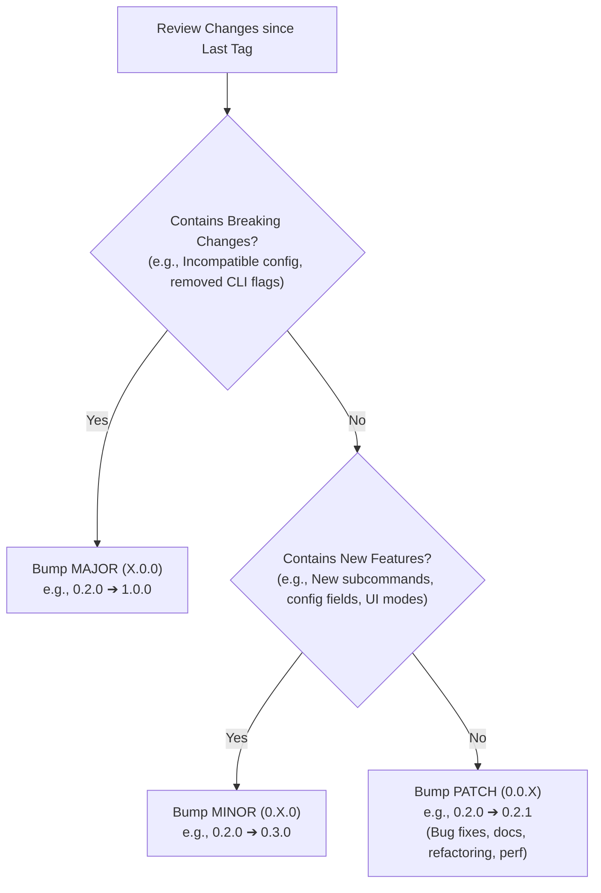
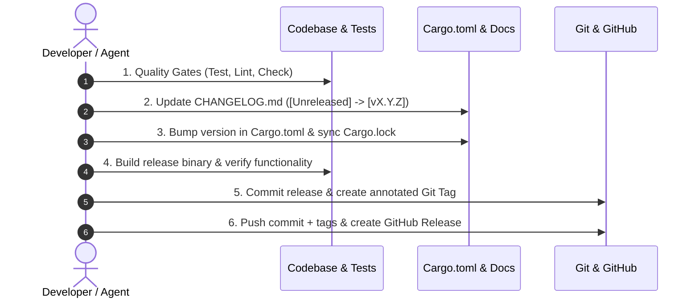

# 🚀 Software Release Workflow Skill

This skill defines the standard, step-by-step release engineering process for software projects (Rust CLI, Web, APIs) adhering to **Semantic Versioning 2.0.0**, **Keep a Changelog**, and **Git Tagging Best Practices**.

---

## 1. Release Decision Tree (SemVer 2.0.0)

When deciding the next version number (`MAJOR.MINOR.PATCH`), evaluate the changes since the last release:



---

## 2. Standard 6-Step Release Checklist

Always execute the release workflow sequentially:



---

### Step 1: Pre-Release Quality Gates
Before modifying version numbers, ensure the codebase is 100% healthy:

```bash
# 1. Ensure working directory is clean or changes are intended
git status

# 2. Run all unit & integration tests
cargo test --all-targets

# 3. Check for compiler lints and warnings
cargo clippy -- -D warnings

# 4. Check code formatting
cargo fmt --check
```

---

### Step 2: Update `CHANGELOG.md`
Follow the [Keep a Changelog](https://keepachangelog.com/en/1.1.0/) specification:

1. Move all completed items from `## [Unreleased]` into the new version header `## [X.Y.Z] - YYYY-MM-DD`.
2. Group items under standard categories:
   - `### Added`: New user-facing features or commands.
   - `### Changed`: Changes in existing functionality.
   - `### Deprecated`: Features to be removed in future releases.
   - `### Removed`: Features removed in this release.
   - `### Fixed`: Any bug fixes.
   - `### Security`: Vulnerability patches.
3. Keep an empty `## [Unreleased]` section at the top for future work.

**Example `CHANGELOG.md` snippet:**
```markdown
## [Unreleased]

### Planned
- Future feature...

---

## [0.3.0] - 2026-08-19

### Added
- Auto-update notification banner and `procman upgrade` command.
- Mobile QR code popup modal in TUI dashboard.

### Fixed
- Fixed URL parsing timeout on slow internet connections.
```

---

### Step 3: Bump Version in Project Manifests

#### For Rust projects (`Cargo.toml`):
1. Update `version = "X.Y.Z"` under `[package]` in `Cargo.toml`.
2. Run `cargo check` to automatically synchronize `Cargo.lock`.

#### For Node / JS projects (`package.json`):
```bash
npm version <major|minor|patch> --no-git-tag-version
```

---

### Step 4: Verify Release Build

Verify that the release target compiles without issues and produces optimized binaries:

```bash
# Compile with production release profile
cargo build --release

# Verify the resulting binary version matches
./target/release/procman --version
```

---

### Step 5: Git Commit & Annotated Tagging

Create a dedicated release commit and an annotated Git tag:

```bash
# 1. Stage release manifest files
git add Cargo.toml Cargo.lock CHANGELOG.md README.md

# 2. Create release commit
git commit -m "chore(release): vX.Y.Z"

# 3. Create annotated Git Tag
git tag -a vX.Y.Z -m "Release vX.Y.Z"

# 4. Push commit and tag to remote
git push origin main --tags
```

> [!IMPORTANT]
> Always use annotated tags (`git tag -a vX.Y.Z -m "..."`) rather than lightweight tags (`git tag vX.Y.Z`). Annotated tags store author, date, and release message metadata.

---

### Step 6: Publish GitHub Release (Optional / Automated)

If `gh` CLI is available:
```bash
# Extract release notes from CHANGELOG.md for the version
gh release create vX.Y.Z \
  --title "vX.Y.Z" \
  --notes "See CHANGELOG.md for details" \
  ./target/release/procman
```

Or trigger GitHub Actions CI/CD to automatically generate pre-compiled multi-platform binaries.

---

## 3. Automation Recipes

### A. One-Command Release using `cargo-release`
If `cargo-release` is installed (`cargo install cargo-release`):

```bash
# Dry run first to preview changes
cargo release minor --dry-run

# Execute full release (updates Cargo.toml, Cargo.lock, commits, tags, pushes)
cargo release minor --execute
```

### B. Helper Script (`scripts/release.sh`)
```bash
#!/usr/bin/env bash
set -euo pipefail

NEW_VERSION="${1:-}"
if [ -z "$NEW_VERSION" ]; then
  echo "Usage: ./scripts/release.sh <version> (e.g. 0.3.0)"
  exit 1
fi

echo "🚀 Running quality checks..."
cargo test
cargo clippy

echo "📦 Bumping version to $NEW_VERSION in Cargo.toml..."
sed -i -E "s/^version = \".*\"/version = \"$NEW_VERSION\"/" Cargo.toml
cargo check

echo "📝 Please review CHANGELOG.md, then press Enter to continue..."
read -r

git add Cargo.toml Cargo.lock CHANGELOG.md
git commit -m "chore(release): v$NEW_VERSION"
git tag -a "v$NEW_VERSION" -m "Release v$NEW_VERSION"
git push origin main --tags

echo "✅ Successfully released and pushed v$NEW_VERSION!"
```

---

## 4. Agent Guidelines for Releasing

When a user requests: *"Release version X.Y.Z"*, *"Bump version"*, or *"Create a new release"*:

1. **Ask for confirmation** on the target version if ambiguous (Minor vs Patch).
2. **Execute tests first** (`cargo test`) to ensure no broken code is released.
3. **Update `CHANGELOG.md`** accurately summarizing recent git commits/features.
4. **Update `Cargo.toml`** and run `cargo check` to update `Cargo.lock`.
5. **Commit and Tag** with standard commit message `chore(release): vX.Y.Z`.
